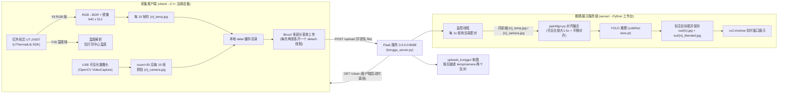
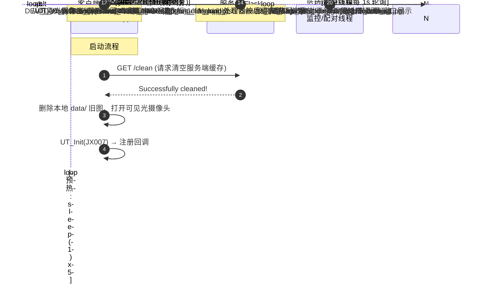

# Konggu（空鼓）：应用热成像与图像拼接技术的墙体缺陷智能检测装置

> **一句话概述**：本项目是一套**应用热成像与图像拼接技术的墙体缺陷智能检测装置**软件代码包，
> 用于替代传统人工高空作业，实现墙体**空鼓、裂缝、渗水**等缺陷的自动化、可视化检测。
> 空中端无人机搭载树莓派 4B，同步驱动热成像（UTi537B，640×512）与可见光（2560×1440）
> 两路相机；地面工作站接收图像后，经 **YOLO11n-seg 实例分割 + 可见光全景拼接 + 双光标定融合**，
> 生成带缺陷轮廓标注的墙体全貌图。

> ⚠️ 状态说明：项目软硬件 Demo 已可正常运行。本仓库代码为早期开发/教学形态的**参考实现**，
> 与当前 Demo 在硬件取流方式与部分算法上存在演进差异（详见“八、已知限制与版本差异”），
> 请以 Demo 实际适配版本为准。

---

## 一、系统架构

采集与推理被拆分为两个独立程序，通过 HTTP 通信（下方架构图为仓库**参考实现**的行为；
当前 Demo 的算法主链路已升级为“YOLO 实例分割 + 全景拼接 + 标定融合”，见“七、关键算法与自研部分”）。

**当前适配的成套软硬件（Demo，已可正常运行）**：

- **空中端**：旋翼无人机，机载 **树莓派 4B**（Broadcom BCM2711，1.5 GHz CPU），并同时挂载
  **热成像摄像头 UTi537B**（640×512，RGB888 输出）与**可见光摄像头**（2560×1440）。
  树莓派负责控制两路相机同步采集，并通过 WiFi 局域网与地面工作站通信。
- **地面端**：高性能工作站（Intel i5-1035G4 + AMD Radeon 630 GPU + 16 GB RAM，Windows 10），
  负责接收数据、运行 AI 模型与图像处理。
- **软件流程**：客户端（树莓派 C++）用 OpenCV 循环捕获两路画面，每 10 帧抽取 1 帧，将热成像
  原始 RGB 转 BGR 后经 libcurl 以 HTTP multipart/form-data 上传至 Flask `/upload`；服务端保存
  图像 → 以自训练 **YOLO11n-seg** 对热成像做像素级缺陷识别（输出检测框、置信度与分割掩码）→
  将可见光多张局部图拼接为全景长图 → 依标定平移参数（`trans 100,-10`，对应热像/可见光垂直视差 Δh）
  把缺陷结果对齐到可见光全景 → 生成带标注的墙体全貌图。

> 注：图中节点/时序反映了仓库内早期代码（JX007 机芯 + YOLO 检测）的实际行为；如需对照 Demo
> 主链路，请以本节文字与“七”为准。



**设计要点**（均来自代码实际行为）：

- 客户端把**温度数据（Y16→温度数组）仅用于打印中心温度**，并不上传；上传的是伪彩色热图（铁红 palette）与可见光图。
- 服务端推理输入实际是**对齐后裁剪出的可见光图区域**（`covered_visible_img`），而非热图（源码中留有该疑问注释）。
- 客户端上传是"每 10 帧、两张图各自 `std::thread().detach()`"的临时策略，服务端则依赖**文件名前缀配对**，二者通过约定的 `${序号}_temp.jpg` / `${序号}_camera.jpg` 命名衔接。

---

## 二、数据流时序图



---

## 三、目录结构

> 现有源码目录（`Konggu/`、`konggu-server/`、`TestCamera/`）与标准 GitHub 布局的对应关系，
> 就是把 `Konggu/`→`client/`、`konggu-server/`→`server/`、`TestCamera/camera_main.cpp`→`client/tools/`
> 改名迁移；目录用途见下方树形结构。

```
konggu-all/
├── README.md                      # 本文件：概述、架构、依赖、构建运行
├── .gitignore                     # 忽略编译产物 / 缓存 / 临时上传
├── config.example.ini             # 运行时参数模板（当前为硬编码参考）
│
├── client/                        # ── 采集/上传端（C++，嵌入式/Linux）──
│   ├── CMakeLists.txt             # 构建脚本示例（自动查找 OpenCV/CURL/json 等）
│   ├── main.cpp                   # ← 源码来自 Konggu/main.cpp（JX007 主程序）
│   ├── main-backup.cpp            # ← 源码来自 Konggu/main-backup.cpp（旧线程版，仅参考）
│   ├── include/                   # ← Konggu/include/  UT SDK 头文件
│   │   ├── UThermalLib.h
│   │   ├── UTDF.h
│   │   └── UTERROR.h
│   ├── lib/                       # ← Konggu/lib/  供应商 SDK 预编译 .so
│   ├── data/                      # 运行时：本地图片缓存（自动清空/写入）
│   └── tools/
│       └── camera_main.cpp        # ← TestCamera/camera_main.cpp 摄像头自检工具
│
├── server/                        # ── 推理/展示端（Python/Flask + YOLO）──
│   ├── requirements.txt           # Python 依赖清单
│   ├── konggu_server.py           # ← konggu-server/konggu_server.py  服务入口
│   ├── KongguProcessFiles.py      # ← 目录监控 + 文件对配对 + YOLO 推理
│   ├── pairAlign.py               # ← 红外/可见光对齐、裁剪、融合
│   ├── MergeImage.py              # ← 全景拼接工具（当前主流程未调用）
│   ├── konggu_models/             # ← YOLO 权重（仓库内 cold/hot-best.pt；Demo 为 cold/warm-best.pt）
│   ├── uploads_konggu/            # 运行时：接收的图片（自动创建）
│   └── out_konggu/                # 运行时：推理结果输出（自动创建）
│
└── docs/                          # ── 文档 ──
    ├── DEPLOYMENT.md              # 多机/单机部署、后台运行、开机自启
    └── CODE_REVIEW_NOTES.md       # 代码注释缺失点 / 潜在风险记录（不改代码）
```

各目录用途小结：

| 目录 | 用途 |
|---|---|
| `client/` | 运行在采集侧（树莓派/嵌入式 Linux）的 C++ 程序：初始化热成像机芯、抓拍可见光、成对上传 HTTP。 |
| `server/` | 运行在工作台的 Python 服务：接收上传、轮询配对、图像对齐融合、YOLO 检测、窗口展示、结果落盘。 |
| `docs/` | 部署指南与代码审查记录。 |
| `data/`、`uploads_konggu/`、`out_konggu/` | 运行期产物目录，不入库（见 `.gitignore`）。 |

---

## 四、硬件与软件依赖

### 4.1 硬件

| 层级 | 硬件 | 规格 / 说明 |
|---|---|---|
| 空中端 | 旋翼无人机 | 搭载树莓派 4B 与双相机，执行墙体巡检拍摄 |
| 空中端 | 树莓派 4B | Broadcom BCM2711，1.5 GHz CPU；控制两路相机同步采集并通过 WiFi 与地面端通信 |
| 空中端 | 热成像摄像头 UTi537B | 640×512，RGB888 输出 |
| 空中端 | 可见光摄像头 | 2560×1440 |
| 地面端 | 工作站 | Intel i5-1035G4 + AMD Radeon 630 GPU + 16 GB RAM + Windows 10；接收数据、运行 AI 模型与图像处理 |
| 参考实现 | 红外机芯 | 仓库 C++ 参考实现基于 UThermalLib SDK 的 **UT-JX007**（`UT_Init(UT_JX007)`）；与 Demo 的 UTi537B 取流方式不同，移植时需替换取流层 |
| 参考实现 | USB 可见光摄像头 | OpenCV `VideoCapture(0)`（Linux `/dev/video0`） |

> 注意：CMake 注释中残留了 aarch64（JX003）与 rockchip830 交叉编译路径，且链接了
> `rknn_api`，暗示该 SDK 历史上有多个平台（JX002/003/004/007）与 NPU 加速的使用经历；
> 本模板**不假定**你手头是哪块板子，仅以 JX007 + `lib/` 内 .so 为准。

### 4.2 客户端软件依赖（C++）

| 依赖 | 用途 | 获取方式 |
|---|---|---|
| CMake ≥ 3.10 | 构建 | 发行版包管理器 |
| GCC/G++（支持 C++11） | 编译 | 发行版包管理器 |
| **OpenCV**（`cv::VideoCapture`、`cv::imwrite`） | 可见光取图/图像读写 | `find_package(OpenCV)` |
| **libcurl**（多部分表单上传 / GET） | HTTP 上传与 `/clean` | `find_package(CURL)` |
| **nlohmann/json** | 解析服务端 JSON 响应 | `find_package(nlohmann_json)` 或头文件 |
| pthread | 上传线程 | `find_package(Threads)` |
| UThermalLib SDK 私有库 | 机芯驱动 | 随项目 `lib/` 分发（供应商提供） |
| `libunitcam.so`、`libusb-1.0.so` | 机芯通信底层 | 同上 |
| `libThermaltool.so`、`libimage_algorithms_lite.so` | 温度/图像算法 | 同上 |
| `librknn_api.so` | RKNN NPU 运行时（部分平台需要） | 同上 / 瑞芯微 SDK |

### 4.3 服务端软件依赖（Python）

由代码 import 提取（详见 `server/requirements.txt`）：

- `torch` + `torchvision`（代码导入 `torch.cuda`；建议装 CUDA 版）
- `ultralytics`（YOLO 推理，`from ultralytics import YOLO`）
- `opencv-python`（图像处理/显示）
- `flask`（HTTP 服务）
- `numpy`
- `Pillow`（`pairAlign.py`/`test_flask.py` 用到）
- `matplotlib`（`pairAlign.py` 用到 cm/colors）
- `scipy`、`natsort`（`konggu_server.py` 中导入但**当前代码并未真正使用**，历史遗留）
- 推理权重：仓库内为 `server/konggu_models/cold-best.pt`（低温）、`hot-best.pt`（高温）；
  当前 Demo 命名为 `cold-best.pt` / `warm-best.pt`（差异见“八”）

---

## 五、安装与编译

> 说明：本节给出的是**本仓库参考实现**的构建/运行方式（服务端部分与 Demo 基本一致，
> 客户端部分对应早期 JX007 机芯取流）。当前 Demo 的客户端改为在树莓派 4B 上用 OpenCV
> 直读 UTi537B（RGB888）与可见光两路 USB 相机并上传，构建方式以此处为准做相应替换即可
> （取流层差异见“八、已知限制与版本差异”）。

### 5.1 客户端（C++）

Ubuntu/Debian 类系统为例，安装系统依赖：

```bash
sudo apt-get update
sudo apt-get install -y build-essential cmake libopencv-dev libcurl4-openssl-dev nlohmann-json3-dev
# 若发行版无 nlohmann-json 包，可将 nlohmann/json.hpp 放入 SDK include 目录
```

确认 SDK 私有库与头文件就位后编译：

```bash
cd client
cmake -S . -B build
cmake --build build -j
# 若 SDK 库不在 ./lib，可用 -DKONGGU_SDK_DIR=/绝对/路径 指定
```

运行（需在有显示/取流权限的采集机上，从 `build/` 内执行以匹配相对路径 `../data`）：

```bash
cd build
export LD_LIBRARY_PATH=../lib:$LD_LIBRARY_PATH   # 运行时能找到私有 .so
./main
```

> 交叉编译：把 `client/CMakeLists.txt` 中注释的交叉工具链区段取消注释并改成你的编译器即可。

### 5.2 服务端（Python）

建议使用虚拟环境：

```bash
cd server
python3 -m venv .venv
source .venv/bin/activate            # Windows: .venv\Scripts\activate
pip install -r requirements.txt
```

若装有 CUDA 环境，可先单独安装匹配版本的 GPU 版 PyTorch（详见 PyTorch 官方安装页），
再执行上面的 `pip install -r requirements.txt`（`ultralytics` 会自动补齐其余依赖）。

启动（需在 `server/` 目录内执行，模型路径与上传/输出目录均为相对路径）：

```bash
python konggu_server.py
# 启动时会交互询问：键入 1 加载低温模型，键入 2 加载高温模型
```

---

## 六、如何修改运行时参数

> ⚠️ **重要提示**：当前版本几乎所有参数都是**写死在源码中**的，程序**并不会读取**
> `config.example.ini`。该配置文件仅作为"可调参数清单 + 未来改造目标"提供给维护者。
> 修改参数后需要重新编译（C++）或重启服务（Python）。

### 6.1 客户端（`client/main.cpp`）

| 想改什么 | 找到哪里 | 说明 |
|---|---|---|
| 服务端地址/端口 | 全局 `url` 常量（`main.cpp` 顶部） | 形如 `http://192.168.x.x:8088`；`/upload`、`/clean` 基于它拼接 |
| 图像分辨率 | `IMAGE_W` / `IMAGE_H`（`#define`） | 当前恒为 `640x512`，需与机芯输出一致 |
| 保存/上传节拍 | `count % 10 == 0` | 改为 `% N` 可调"每 N 帧存一对图" |
| 上传起始帧 | `if (count > 30)` | 前 30 帧仅本地存热图、不上传（预热） |
| 调色板 | `UT_PALETTE_TYPE pt = UT_PALETTE_IRON` | 可换成 `WHITEHOT`、`RAINBOW` 等（见 `UTDF.h`） |
| 摄像头编号 | `cv::VideoCapture cap(0)` | 0 = `/dev/video0` |
| 本地缓存目录 | `"../data"`（含删除/保存路径） | 注意是相对 `build/` 运行目录 |

### 6.2 服务端（Python）

| 想改什么 | 找到哪里 | 说明 |
|---|---|---|
| 监听地址/端口 | `app.run(host='0.0.0.0', port=8088)`（`konggu_server.py`） | 客户端 `url` 需与之一致 |
| 模型 | 启动时的 `input()` 分支，映射到 `konggu_models/xxx-best.pt` | 目前必须人工 1/2 选择，无法从外部传入 |
| 上传/输出目录 | 模块级 `upload_dir='uploads_konggu'`、`out_dir='out_konggu'` | 相对运行目录 |
| 轮询间隔 | `time.sleep(1)`（`monitor_directory`） | 扫描上传目录的频率 |
| 图像对齐参数 | `pair_align_func_konggu(..., rescale_factor=1.5, trans_x=100, trans_y=-10)`（`KongguProcessFiles.py`） | 与红外/可见光的**固定安装位姿**相关，更换安装后需重标定 |
| 输出图宽 | `new_width = 640`（`KongguProcessFiles.py`） | 推理结果保存宽度 |
| 融合透明度 / 全景重叠 | `pairAlign.py` 中 `addWeighted(...,0.5,0.5,...)`；`MergeImage.py` 的 `overlap_length=50` | 后一个当前未接入主流程 |

---

## 七、关键算法与自研部分（当前 Demo）

> 本节描述的是项目当前 Demo 的算法与自研工作（据项目团队提供的信息整理），
> 可作为仓库代码后续演进的目标形态。仓库内早期代码与本节存在差异时，以本节/Demo 为准，
> 差异点汇总见“八、已知限制与版本差异”。

### 7.1 模型训练（YOLO11n-seg 实例分割）

- 团队自制**模拟墙体缺陷样品**，在**低温（10°C、25°C）**与**高温（40°C、55°C）**两种环境下，
  分别从 **40 cm 与 80 cm** 距离拍摄约 **1000 张**热成像照片；
- 使用 **LabelMe** 标注，按 **8:2** 划分训练/验证集；
- 在 YOLO 框架下训练出 **YOLO11n-seg 实例分割模型**（权重：低温版 `cold-best.pt`、高温版
  `warm-best.pt`），可对热成像图像做像素级缺陷识别，输出检测框、置信度及分割掩码。

### 7.2 可见光图像拼接（生成墙体全貌长图）

- 对无人机采集的可见光局部图进行**畸变校正 → 特征点匹配 → 投影变换**后依次拼接，
  生成完整的墙体立面长图。
- 仓库内对应模块：`server/MergeImage.py`（当前为简化实现，尚未接入主流程，见“八”）。

### 7.3 热像 / 可见光数据融合（缺陷标注叠加）

- 通过实测**标定两个摄像头的安装高度差**，得到平移参数 `trans 100,-10`（对应热像与可见光
  之间的垂直视差 Δh，即仓库代码中的 `pair_align_func_konggu(..., trans_x=100, trans_y=-10)`）；
- 将热成像上的缺陷检测结果平移对齐到可见光全景坐标系，最终生成带缺陷标注的墙体全貌图。

---

## 八、已知限制与版本差异

### 8.1 仓库参考实现 vs 当前 Demo 的版本差异（重要）

本仓库是早期开发/教学形态的参考实现，而项目当前已交付可正常运行的软硬件 Demo。二者在
**取流硬件、模型形态与算法主链路**上并不完全一致，对照或迁移时请注意：

| 维度 | 仓库参考实现（本仓库代码） | 当前 Demo（已正常运行） |
|---|---|---|
| 采集端平台 | 嵌入式 Linux + UThermalLib SDK（机芯 UT-JX007，USB） | 无人机 + 树莓派 4B + OpenCV 直读两路 USB 相机 |
| 热成像设备 | JX007 机芯（Y8/Y16 原始帧） | UTi537B（640×512，RGB888 输出） |
| 可见光设备 | USB 摄像头 `/dev/video0` | 2560×1440 可见光相机 |
| 模型形态 | YOLO（检测，class 0 框选） | YOLO11n-seg（实例分割，输出掩码） |
| 推理输入 | 对齐后的可见光区域（`rgb_img`） | 热成像图像（缺陷像素级识别） |
| 全景拼接 | `MergeImage.py` 简化实现，未接入主流程 | 畸变校正+特征匹配+投影变换的可见光全景拼接 |
| 融合对齐 | `pairAlign.py` 平移+叠加（`trans 100,-10`） | 按标定高度差平移热像缺陷框到可见光全景（Δh 标定） |
| 模型权重命名 | `cold-best.pt` / `hot-best.pt` | `cold-best.pt`（低温）/ `warm-best.pt`（高温） |

> 简单说：仓库代码证明了“双光采集 → 上传 → 对齐 → 模型推理”这条链路可行；
> Demo 在此之上把模型换成分割、把输入切到热图、并补上了可见光拼接与全貌图生成。

（下方第 1–7 条为仓库代码自身的真实取舍；更完整的安全/并发清单见 `docs/CODE_REVIEW_NOTES.md`）

1. **"每 10 帧丢两个 detach 线程上传"是稳定性权宜之计**：`main.cpp` 为不阻塞采集主循环，
   每次上传都新建 `std::thread` 并 `detach()`，**没有线程池/上限/失败重传**。网络抖动时线程可能堆积。
   早期版本（`main-backup.cpp`）用"读线程 + 解析线程 + 环形队列"的解耦方案，但被简化为当前同步循环，
   故 `main.cpp` 中保留了循环队列等一整套未启用的结构体与注释代码（历史遗留）。
2. **服务端依赖文件名配对且无超时机制**：只有 `{n}_temp.jpg` 或只有 `{n}_camera.jpg` 到达时，
   该文件会一直滞留在 `unprocessed_files` 等待另一半，不会自动清理/告警。
3. **推理输入是可见光图而非热图**：`KongguProcessFiles.py` 中 `self.model(rgb_img)` 传入的是
   裁剪后的可见光区域，源码里也留有"为什么推理用 rgb_img"的疑问注释。若缺陷判定希望直接利用
   热图特征（如空鼓热斑、温差异常），则这属于**待确认的设计取舍**。
4. **`cv2.imshow` 需要图形桌面**：服务端在无显示环境（SSH/无头服务器）下会因 imshow 抛异常，
   导致该文件对处理失败并反复重试。当前无"无头模式"开关。
5. **温度数据只打印不上传**：客户端解析出整幅温度数组，仅打印中心温度；检测决策完全依赖视觉模型。
6. **存在未接入的死代码**：`konggu_server.py` 中 `show_data()`（注释"有使用吗??"）、
   `monitor_last_time()`（注释"哪里用上了??"）以及 `MergeImage.py`（全景拼接）定义了但**从未被启动线程调用**。
7. **调试期残留**：客户端大量 `cout<<"100"`、`printf("gua")` 等调试输出；`UTDF.h` 部分注释存在
   编码乱码；`main-backup.cpp` 与 `Konggu/main-backup.cpp` 为历史版本备份。

---

## 九、License

> 本项目采用**保留所有权利（All Rights Reserved）** 许可，详见仓库根目录 `LICENSE` 文件。
>
> - 源码与文档默认仅限版权人授权的内部教学、科研与项目研发使用；再分发与商用需书面许可。
> - `include/`、`lib/` 下的供应商私有 SDK（UThermalLib、unitcam、Thermaltool、
>   image_algorithms_lite、librknn_api、libusb 等）与 `*.pt` 模型权重**不在授权范围内**，
>   其使用/分发须遵守各自权利人的许可约定。
> - 版权人：广东华侨中学（Guangdong Overseas Chinese High School）。
